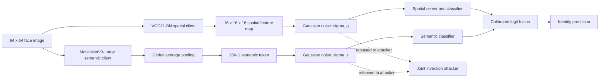

# DDP-CEM: Dual-Path Privacy Protection for Collaborative Face Inference

This repository contains the research code and audited result summaries for a
dual-path defence against model inversion attacks in collaborative face
inference. It is the code companion to a Pattern Recognition manuscript in
preparation; the manuscript itself is maintained separately on Overleaf.

## Method at a glance

The current implementation releases two noised representations to the server:



The G-Path preserves a spatial feature map. Slot-CEM is used only while
pretraining this client: it models class-conditional structure across images of
the same identity with a bounded memory bank and a geometric within-slot
variance. It does **not** transmit a prototype-compressed tensor. The S-Path
uses global average pooling and a 256-dimensional projection. The deployed
fusion is a learned global mixing coefficient with one learned temperature per
path; it is not an input-dependent gate.

## Evidence currently available

The audited FaceScrub evidence in [`results/facescrub`](results/facescrub)
contains five target adaptations and repeated attack training runs:

| Quantity | Current result |
|---|---:|
| Fused top-1 accuracy | 81.96% |
| G-Path-only accuracy | 58.69% |
| S-Path-only accuracy | 74.75% |
| Decoder MSE, training knowledge | 0.0265 |
| Decoder MSE, inference knowledge | 0.0371 |
| GAN MSE, training knowledge | 0.0310 |
| GAN MSE, inference knowledge | 0.0404 |

Higher reconstruction MSE indicates poorer reconstruction and therefore
stronger privacy under the stated attacker. The published Noise_ARL+CEM
reference reports 80.33% accuracy and decoder/GAN MSE values of
0.0182/0.0211 and 0.0212/0.0231. Those published values are an external
reference, not a locally reproduced matched baseline.

These results support the current FaceScrub observation, but they are not yet a
complete journal evidence package. All five target adaptations reuse one frozen
G-Path foundation. A strict official-CEM reproduction, independent end-to-end
target seeds, identity-conditioned joint attacks, fusion/noise/token ablations,
and cross-dataset experiments remain pending. See
[`docs/EXPERIMENT_STATUS.md`](docs/EXPERIMENT_STATUS.md).

## Repository layout

| Path | Contents |
|---|---|
| `src/publication_cem/` | Reusable models, objectives, data utilities, metrics, and attackers |
| `scripts/` | Training, attack, aggregation, profiling, and resumable experiment runners |
| `configs/` | FaceScrub and cross-dataset experiment configurations |
| `tests/` | Unit, protocol, recovery, and regression tests |
| `results/facescrub/` | Public aggregate CSV/JSON evidence; no face images or checkpoints |
| `archive/current_artefact/` | Dissertation-era VGG/Slot-CEM code required by the current DDP runner |
| `archive/upstream_cem/` | Snapshot of the upstream CEM implementation for matched comparison |
| `docs/` | Architecture, data, reproducibility, status, and collaborator handoff notes |

The repository intentionally excludes the manuscript, supervisor comments,
private correspondence, raw FaceScrub images, model checkpoints, and server
credentials.

## Installation and verification

The reported GPU environment used Python 3.11, PyTorch 2.2.2,
torchvision 0.17.2, and CUDA 12.1.

```bash
conda env create -f environment/conda-linux-64.yml
conda activate publication-cem
python -m pip install -e '.[dev,evaluation,analysis]'
python -m pytest -q
```

Dataset preparation is documented in
[`docs/DATA_SETUP.md`](docs/DATA_SETUP.md). Do not commit downloaded face
images to this repository.

## Main experiment entry points

Run the completed FaceScrub DDP protocol with recoverable state and per-job logs:

```bash
python scripts/run_dual_path_publication_pipeline.py \
  --data-root /path/to/facescrub_official \
  --legacy-checkpoint-dir /path/to/slot_cem_checkpoint \
  --stage all --attempts 3 --retry-seconds 60
```

Run the experiments requested during the latest manuscript review:

```bash
python scripts/run_supervisor_revision_experiments.py \
  --data-root /path/to/facescrub_official \
  --legacy-checkpoint-dir /path/to/slot_cem_checkpoint \
  --targets-root results/dual_path_publication/targets
```

That runner covers fusion evaluation, noise sensitivity, token dimensions, and
the explicit identity-conditioned joint-attack protocol. It is resumable, but
the architecture and exact run matrix should be frozen with the authors before
consuming the collaborator's GPU allocation.

## Data and checkpoints

FaceScrub images are not redistributed here. The original release provides
image URLs rather than permission to republish a processed copy. Use the
sources and deterministic preparation procedure in
[`docs/DATA_SETUP.md`](docs/DATA_SETUP.md). Existing foundation checkpoints
should be transferred privately and verified by SHA-256; they must not be put
in a public Google Drive folder.

## Research status and claims

This is a research preview, not an accepted paper or a claim of guaranteed
venue acceptance. Code tests establish software consistency; only completed,
matched experiments can establish scientific superiority. The open evidence
requirements are recorded before further experiments so that negative results
are not silently discarded.

## Attribution and licensing

See [`ATTRIBUTION.md`](ATTRIBUTION.md). The upstream CEM snapshot retains its
original licence. A licence for the newly written research code must be agreed
by all authors before a formal public release; no additional permission is
granted by the absence of a repository-level licence.
